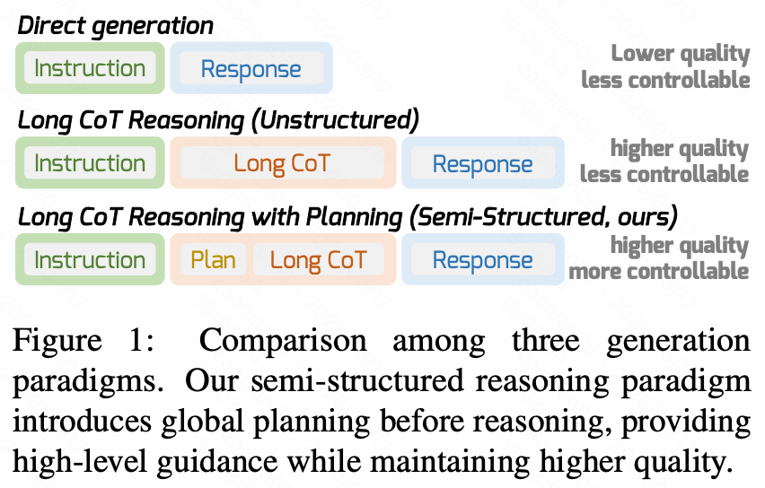

<a name="readme-top"></a>
<p align="center">
  <h1 align="center">DPWriter: Reinforcement Learning with Diverse Planning Branching for Creative Writing</h1>
</p>


<div align="center">
  <a href="https://arxiv.org/pdf/2601.09609"></a>
  <a href="https://huggingface.co/datasets/Aman/DPWriterData"></a>
  <a href="https://github.com/Aman-4-Real/CrEval"></a>
  <br/>
  <hr>
</div>


<span id='news'/>

## 🔥 News

<div class="scrollable">
    <ul>
      <li><strong>[2026, Mar 17]</strong>: &nbsp;🎉🎉We release the <a href="https://huggingface.co/datasets/Aman/DPWriterData">dataset</a> and the <a href="https://github.com/Aman-4-Real/DPWriter">code</a> Feel free to use!</li>
      <li><strong>[2026, Jan 14]</strong>: &nbsp;🎉🎉Our <a href="https://arxiv.org/pdf/2601.09609">arXiv paper</a> is available! Check it out for more details.</li>
    </ul>
</div>
<span id='table-of-contents'/>

## 📑 Table of Contents

* <a href='#news'>🔥 News</a>
* <a href='#brief_intro'>📍 Brief Intro</a>
* <a href='#usage'>⚡ Usage</a>
  * <a href='#setup'>Setup</a>
  * <a href='#train'>Train</a>
* <a href='#cite'>🌟 Cite</a>


<span id='brief_intro'/>

## 📍 Brief Intro

This work addresses the diversity collapse problem in RL fine-tuning for LLMs by introducing a framework based on a semi-structured long Chain-of-Thought. We propose Diverse Planning Branching to introduce divergence at the planning stage based on diversity variation, along with a group-aware diversity reward to encourage distinct generation trajectories. Experiments on creative writing tasks show that our method significantly improves output diversity while maintaining generation quality.

<details>
<summary> Abstract (Click me) </summary>

Reinforcement learning (RL)-based enhancement of large language models (LLMs) often leads to reduced output diversity, undermining their utility in open-ended tasks like creative writing. Current methods lack explicit mechanisms for guiding diverse exploration and instead prioritize optimization efficiency and performance over diversity. This paper proposes an RL framework structured around a semi-structured long Chain-of-Thought (CoT), in which the generation process is decomposed into explicitly planned intermediate steps. We introduce a Diverse Planning Branching method that strategically introduces divergence at the planning phase based on diversity variation, alongside a group-aware diversity reward to encourage distinct trajectories. Experimental results on creative writing benchmarks demonstrate that our approach significantly improves output diversity without compromising generation quality, consistently outperforming existing baselines.
</details>


<p align="center">
  <br/>
  Figure 1. Comparison among three generation paradigms. Our semi-structured reasoning paradigm introduces global planning before reasoning, providing high-level guidance while maintaining higher quality.
</p>


<span id='usage'/>

## ⚡ Usage

<span id='setup'/>

### Setup

Create a new virtual environment:
```
git clone https://github.com/Aman-4-Real/DPWriter.git
cd DPWriter/
conda create -n dpwriter python=3.12
conda activate dpwriter
```
Our code is based on [verl](https://github.com/verl-project/verl). Thanks for their great work!
Using it by installing the version `verl=0.4.1` and the corresponding Python packages.
Change the cudatoolkit version according to your environment if necessary.


<span id='train'/>

### Train

For training, first download the initial ckpt you need and the [DPWriterData](https://huggingface.co/datasets/Aman/DPWriterData) we used. Note that the data we provide is the whole set. You can use it for sft first and use the sft model to filter out those too-easy samples for RL efficiency (for details, refer to our paper).

> However, due to certain copyright policies, we removed some publicly crawled data.

Make sure to update all `YOUR_PATH` fields in the config as needed:

```
### use ngram as diversity metric
bash training_scripts/train_dpwriter_k32_ngram_lambda06.sh

### use emb as diversity metric
bash training_scripts/train_dpwriter_k32_emb_lambda06.sh
```

For the core implementation of DPB in our paper, please refer to [`verl/div_branching/branching_strategy.py`](https://github.com/Aman-4-Real/DPWriter/blob/main/verl/div_branching/branching_strategy.py).

For the rewarding code, please refer to [`dpwriter_rewards/reward_skywork_w_div_norm.py`](https://github.com/Aman-4-Real/DPWriter/blob/main/dpwriter_rewards/reward_skywork_w_div_norm.py).


<hr>

> *We respect and uphold the usage terms of the original data providers. If you believe that any part of this dataset affects your legal rights or raises other concerns, please reach out to us. We will carefully review your request and respond without delay.*


<span id='cite'/>

## 🌟 Cite

<h2> Please cite our paper if you find our work useful. </h2>

```
@article{cao2026dpwriter,
  title={DPWriter: Reinforcement Learning with Diverse Planning Branching for Creative Writing},
  author={Cao, Qian and Liu, Yahui and Bi, Wei and Zhao, Yi and Song, Ruihua and Wang, Xiting and Tang, Ruiming and Zhou, Guorui and Li, Han},
  journal={arXiv preprint arXiv:2601.09609},
  year={2026}
}
```
For any questions, please feel free to contact me at caoqian4real@ruc.edu.cn.


